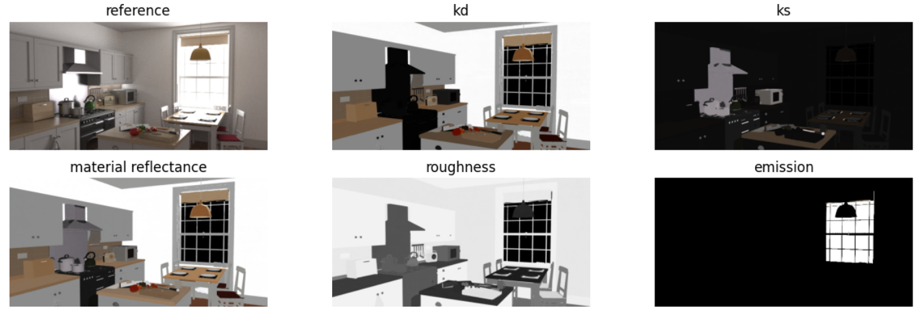

# README

##  Abstract

Decomposing a scene into its material properties and illumination, given the geometry and multi-view HDR observations of an indoor environment, is a fundamental yet challenging problem in computer vision and graphics. Existing approaches, combined with neural rendering techniques, have shown promising results in object-specific scenarios but often struggle with inconsistencies in material estimation within complex indoor scenes. To address this issue, we propose an Adaptive Inverse Rendering method with Hierarchical Clustering. Our method extends Factorized Inverse Path Tracing (FIPT) with a semantic-aware hierarchical clustering approach to obtain more accurate and consistent estimates of albedo, roughness, and metallic properties. Additionally, we introduce a voxel grid filter to further reduce computational time. Experimental results on both synthetic and real-world room-scale scenes demonstrate that our method produces more consistent and accurate material estimations compared to state-of-the-art methods. Furthermore, we showcase promising applications in AR/VR, including novel view synthesis, object insertion, and relighting. Our work contributes to advancing the field of inverse rendering and has the potential to benefit various computer vision and graphics applications.

## Setup

Set up the environment via:

```
conda create --name ir python=3.8 pip
conda activate ir
pip install torch==1.13.1+cu117 torchvision==0.14.1+cu117 torchaudio==0.13.1 --extra-index-url https://download.pytorch.org/whl/cu117
pip install -r requirements.txt
pip install git+https://github.com/NVlabs/tiny-cuda-nn/#subdirectory=bindings/torch # tested with tinycudann-1.7
pip install pyg_lib torch_scatter torch_sparse torch_cluster torch_spline_conv -f https://data.pyg.org/whl/torch-1.13.0+cu117.html
```

### Dataset

The dataset is accessible at [Baidu Cloud](https://pan.baidu.com/s/1wSIU3ke_TbMk_YsB_BdWnQ) using the password "xkao". It includes two synthetic scenes and one real scene. For further information about dataset, please refer to the following repository: https://github.com/lwwu2/fipt.

### Train the model

**1.Initialize shadings:**

```python
# --scene: the path of train dataset; --output: the location where you store your output; 
# --dataset:synthetic or real
python bake_shading.py --scene /proj/users/xlv/lvxin/fipt/data/kitchen --output outputs/kitchen --dataset synthetic
```

**2.Optimize BRDF and emission mask:**

```python
# --dataset{default:'synthetic' or 'real', '../data/indoor_synthetic/kitchen':the path of train dataset,'outputs/kitchen':the location where you store your output on initialize shading}
python train.py --experiment_name kitchen --device 0 --max_epochs 3 --dataset synthetic /proj/users/xlv/lvxin/fipt/data/kitchen outputs/kitchen --voxel_path outputs/kitchen/vslf.npz
```

**3.Extract emitters:**

```python
python extract_emitter.py --scene /proj/users/xlv/lvxin/fipt/data/kitchen --output outputs/kitchen --dataset synthetic --ckpt checkpoints/kitchen/cluster_part.ckpt
```

**4.Shading refinement:**

```python
# --ft : the number of finetune
python refine_shading.py --scene /proj/users/xlv/lvxin/fipt/data/kitchen --output outputs/kitchen --dataset synthetic --ckpt checkpoints/kitchen/cluster_part.ckpt --ft 1
```

## Inference 

**Install conda env to Jupyter**

```
conda activate ir
python -m ipykernel install --user --name=ir
```

You can check the 'demo' directory, which contains Jupyter notebook files for both visualization and quantitative results. Besides, the application of relighting and object inserting can be find.



 